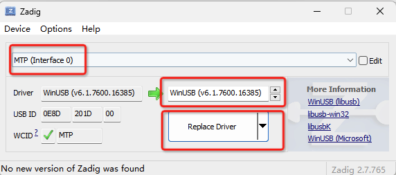

# luck-node-mtp

`nodejs`跨平台安卓设备文件管理工具，基于[libmtp](https://github.com/libmtp/libmtp)。支持`MacOs`、`Windows`、`linux`平台。

[English](./README.md) | 简体中文

## 简单示例

安装
```
npm i luck-node-mtp
```

使用
```
const mtp = require("luck-node-mtp");

// connect first device be found
mtp.connect();

// download from device to local
mtp.download("data/com.ahyungui.android/db/upload.zip","/Users/tmp/upload.zip",(send,total)=>{
        console.log("progress",send,total);
});

// release device
mtp.release();
```

## 更可靠的示例
```
const mtp = require("luck-node-mtp");

// connect first device be found
mtp.connect();

try{
    // download from device to local
    mtp.download("data/com.ahyungui.android/db/upload.zip","/Users/tmp/upload.zip",(send,total)=>{
        console.log("progress",send,total);
    });
}
catch(e)
{
    console.error(e);
}
finally{
    // release device
    mtp.release();
}
```
这样可以确保设备能被释放.

# api

## connect

### 结构

bool connect(uint vid?, uint pid?)

### 说明

连接默认第一个设备.

- @param vid: vendor id
- @param pid: product id
- @return 成功返回`true`，错误返回`true`

```
result = mtp.connect();
```

通过`vendor id`和`product id`访问某一设备，可以通过[getDeviceInfo](#getdeviceinfo)方法获取设备信息。
```
result = mtp.connect(vid,pid);
```

## release

### 结构

bool release()

### 说明

释放当前连接的设备。
设备使用完以后需要被释放，不然再次连接会报错。

- @return 成功返回`true`，错误返回`true`

```
result = mtp.release();
```

## getList

### 结构

array getList(string parentPath)

### 说明

根据父路径获取所有对象清单。

可以通过该方法形成文件树。

 - @param parentPath: 父路径.根地址可传入字符串`/`.
 - @return 文件数组

```
result = mtp.getList("/data/com.ahyungui.android/db/");
console.log("objArr:",result);
```

输出结果实例如下：

```
[
  {
    name: '1',
    size: 0,
    type: 'FOLDER',
    id: 156,
    modificationdate: 1672041505,
    parent_id: 152,
    storage_id: 65537
  },
  {
    name: 'download.zip',
    size: 8893742,
    type: 'FILE',
    id: 158,
    modificationdate: 1673321627,
    parent_id: 152,
    storage_id: 65537
  }
]
```

## getDeviceInfo

### 结构

array getDeviceInfo()

### 说明

如果有多个设备接入，可以通过该方法获取设备清单。

 - @return 设备信息数组

```
result = mtp.getDeviceInfo();
console.log("deviceArr:",result);
```

输出结果实例如下：
```
[
  {
    vendor: 'MediaTek Inc',
    vendor_id: 3725,
    product: 'Elephone P8000',
    product_id: 8221
  }
]
```
## upload

### 结构

bool upload(string localFilePath, string targetFolderPath, string progressCallBackFun?)

### 说明

上传本地文件到设备。

- @param localFilePath: 本地要上传的文件路径
- @param targetFolderPath: 目标设备父文件夹地址
- @param progressCallBackFun: 上传进度的回调函数
  (send, total)=>{}
- @return 成功返回`true`，错误返回`true`

```
result = mtp.upload("/Users/tmp/download.zip", "data/com.ahyungui.android/db",  (send, total) => {
                    console.log("progress", send, total);
});
```

## del

### 结构

bool del(string targetPath)

### 说明

删除文件或文件夹。

如果传入的是文件夹地址，不能保证每台设备都能删除成功，建议递归删除。

- @param targetPath: 设备上要删除的目标地址
- @return 成功返回`true`，错误返回`true`

```
result = mtp.del("/data/com.ahyungui.android/db/download.zip");
```
## getObject

### 结构

object getObject(string targetPath)

### 说明

获取设备内对象信息，包括文件、文件夹等。

- @param targetPath: 设备上文件路径
- @return 返回对象信息

```
result = mtp.get("data/com.ahyungui.android/db/upload.zip");
```

返回结果如下：
```
{
  name: 'upload.zip',
  size: 8893742,
  type: 'FILE',
  id: 163,
  modificationdate: 1673149510,
  parent_id: 152,
  storage_id: 65537
}
```

## copy

### 结构

bool copy(string sourcePath, string targetFolderPath)

### 说明

设备内文件拷贝。

如果拷贝的是文件夹，不能保证在每种设备上都能成功。

该函数目前也未提供任务进度提示，这会卡主线程直到执行完成。

- @param sourcePath: 需要拷贝的文件在设备中的路径
- @param targetFolderPath: 拷贝目标父文件夹地址
- @return 成功返回`true`，错误返回`true`

```
result =  mtp.copy("/data/com.ahyungui.android/db/download.zip","/data/com.ahyungui.android/db/8057");
```

## move

### 结构

bool move(string sourcePath, string targetFolderPath)

### 说明

设备内文件移动。

如果移动的是文件夹，不能保证在每种设备上都能成功。

该函数目前也未提供任务进度提示，这会卡主线程直到执行完成。

- @param sourcePath: 需要拷贝的文件在设备中的路径
- @param targetFolderPath: 拷贝目标父文件夹地址
- @return 成功返回`true`，错误返回`true`

```
result =  mtp.move("/data/com.ahyungui.android/db/download.zip","/data/com.ahyungui.android/db/8057");
```

## setFileName

### 结构

bool setFileName(string targetPath, string newName)

### 说明

设置文件名称。

- @param targetPath: 设备中文件路径
- @param newName: 新名称
- @return 成功返回`true`，错误返回`true`

```
result = mtp.setFileName("/data/com.ahyungui.android/db/download.zip", "download1.zip");
```

## setFolderName

### 结构

bool setFolderName(string targetPath, string newName)

### 说明

设置文件夹名称。

- @param targetPath: 设备中文件夹路径
- @param newName: 新名称
- @return 成功返回`true`，错误返回`true`

```
result = mtp.setFolderName("/data/com.ahyungui.android/db/8057", "8067");
```
## createFolder

### 结构

uint createFolder(string parentFolderPath, string newName)

### 说明

创建文件夹。

- @param targetPath: 创建文件夹的父文件夹路径
- @param newName: 新名称
- @return 文件夹的id

```
result = mtp.createFolder("/data/com.ahyungui.android/db", "test_folder");
```

## getCurrentDeviceStorageInfo

### 结构

array getCurrentDeviceStorageInfo()

### 说明

获得当前连接设备的存储信息。

- @return 存储信息数组

```
result = mtp.getCurrentDeviceStorageInfo();
```

返回结果如下:
```
[ 
  { 
    id: 65537, 
    StorageDescription: '内部共享存储空间', 
    VolumeIdentifier: '' 
  } 
]
```

## setStorage

### 结构

bool setStorage(uint storageId)

### 说明

设置当前连接设备的默认设备存储。

如果设备中有多个存储，可以先通过[getCurrentDeviceStorageInfo方法](#getcurrentdevicestorageinfo)获取设备存储清单，

设置默认存储后，所有的文件管理操作都会默认基于该存储。

如果不设置默认存储，设备会在连接时，选择第一个存储作为默认存储。

- @param storageId: 存储的id
- @return 成功返回`true`，错误返回`true`

```
mtp.connect();

result = mtp.getCurrentDeviceStorageInfo();

console.log("objArr:",result);

result = mtp.setStorage(result[0].id);
    
mtp.release();
```

# 预编译

## Supported systems

目前版本已预编译好`darwin-x64`、`win32-x64`两种系统的二进制文件，这意味着这两种系统的用户可以无需编译直接使用。

其他系统的用户需要自己搭建开发环境重新编译，具体请参考[开发环境](#开发环境)章节。

同时也期待各位小伙伴将自己预编译好的其他系统的`prebuild`文件PR进该项目。

> 注意: windows 平台需要安装`WinUSB`, `libusb-win32` 或者 `libusbK`驱动才可以正常使用，建议使用`Zadig`来
> 管理各设备的驱动，通过`Zadig`来管理的驱动的方式如下:

- 将移动设备接入系统
- 通过`Zadig`菜单列出所有的`USB`设备
- 然后选择`MTP`设备更换驱动
  
  如图:

    

> 注意: 另外，手机连接到系统时，需要选择`文件传输（MTP）`模式才能使用.

## 预编译的持续集成

在`install/after.js`有`Mac`平台下的示例，可以在预编译文件生成后做些后续工作，如：

```
if (os.platform() == "darwin") {
    // init share obj
    shell.exec('cp -rf /usr/local/opt/libmtp/lib/libmtp.9.dylib ' + _rootPath + '/prebuilds/darwin-x64/libmtp.dylib');
    shell.exec('cp -rf /usr/local/opt/libusb/lib/libusb-1.0.0.dylib ' + _rootPath + '/prebuilds/darwin-x64/libusb.dylib');
    shell.exec('install_name_tool -change /usr/local/opt/libmtp/lib/libmtp.9.dylib @loader_path/libmtp.dylib ' + _rootPath + '/prebuilds/darwin-x64/node.napi.node');
    shell.exec('install_name_tool -change /usr/local/opt/libusb/lib/libusb-1.0.0.dylib @loader_path/libusb.dylib ' + _rootPath + '/prebuilds/darwin-x64/libmtp.dylib');
    console.log('node.napi.node links:',shell.exec('otool -L '+_rootPath+'/prebuilds/darwin-x64/node.napi.node'));
    console.log('libmtp.dylib links:',shell.exec('otool -L '+_rootPath+'/prebuilds/darwin-x64/libmtp.dylib'));
}
```

# 开发环境

## Mac

需要安装`xcode`、`nodejs 14+`开发环境.

另外需要安装`libmtp`库:
```
brew install libmtp
```

## Windows

需要安装`Visual Studio`、`nodejs 14+`、`python3`开发环境.

## linux

需要安装`libmtp-dev`:
```
sudo apt-get install libmtp-dev
```

# 测试

可以运行如下命令测试`test`文件下的文件：

```
// test test/test_connect.js
npm run test connect
```

# 已知问题

- Windows下，getCurrentDeviceStorageInfo方法获取的存储名称包含中文可能会乱码.

# 开发参考链接

- [node-addon-api](https://github.com/nodejs/node-addon-api)
- [prebuildify](https://www.npmjs.com/package/prebuildify)
- [libmtp](https://github.com/libmtp/libmtp)
- [libusb](https://github.com/libusb/libusb)


